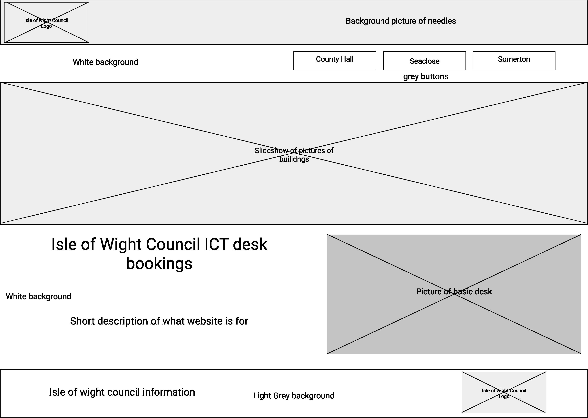
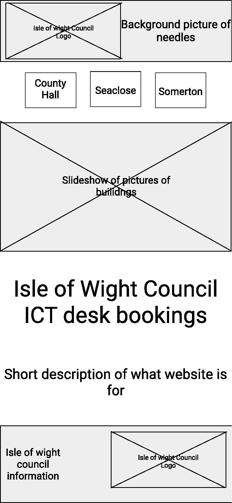
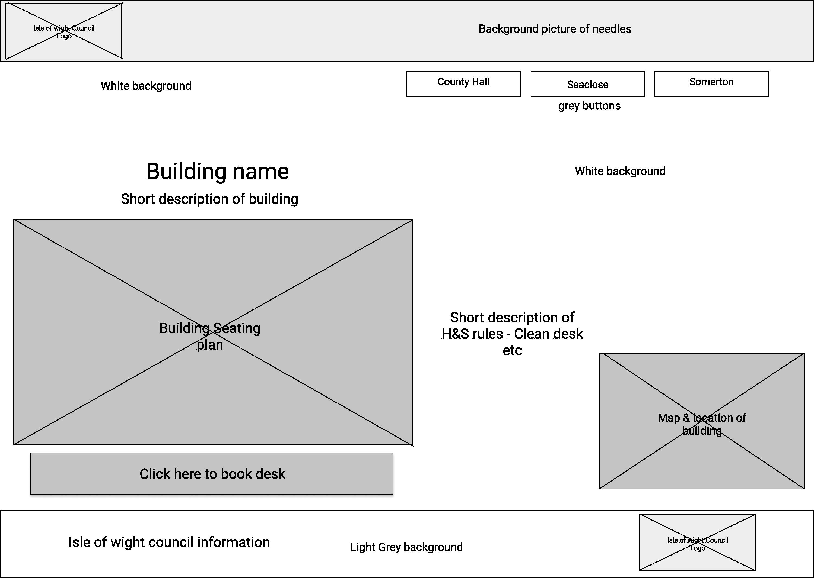
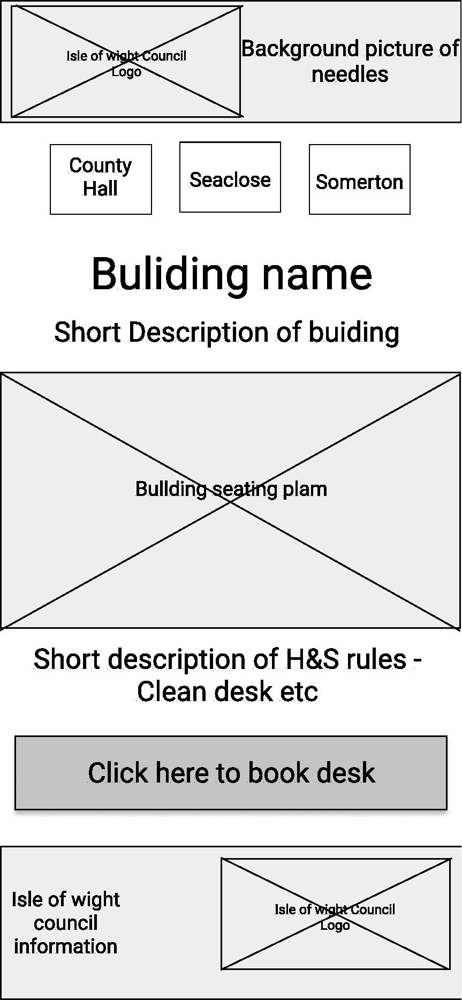
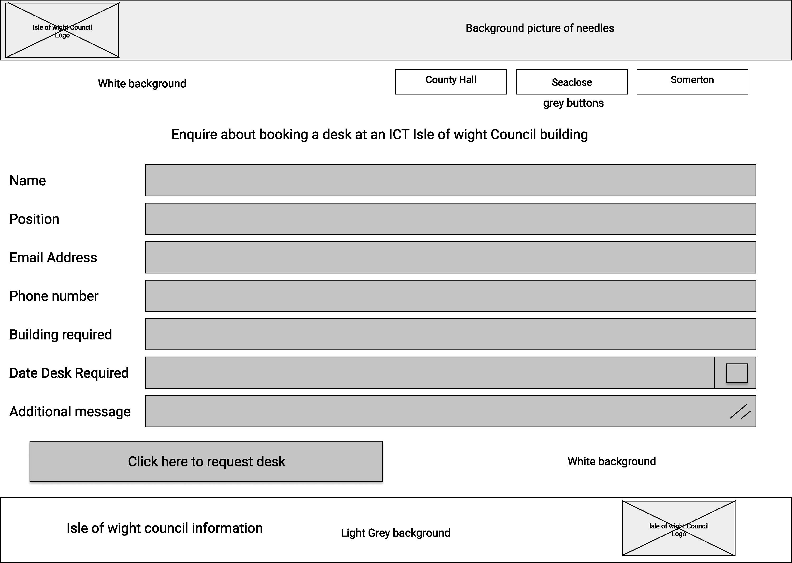
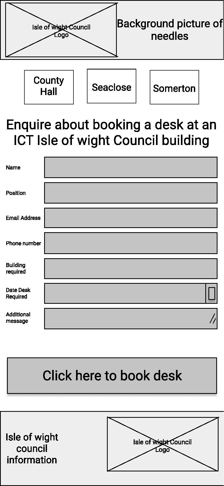

<h1>Alastair Cox Web Tech Assessment</h1>

<h2>Background</h2> 

The problem I would like to solve is the issue around working space during the COVID-19 pandemic. During this time we have been advised to keep socailly distanced and have been suggested a two meter rule be put in place. I would like to make a website where it is possible to book a desk at a place of work in the Isle of Wight Council.

The website would consist of an Index page which shows the buildings available to book a desk at, three pages which show the layouts of the desks and the buildings themselves and a single page for data capture 

<h2>Wire Frames</h2> 

Below is a rough idea of what the index page on the website will look like. 

Below is a rough idea of what  the building pages will look like. Each page will show the specific info for each buliding, but the overall layout will be the same.

Below is a rough idea of what the booking pages will look like.

<h2>Colour Choices</h2>

The colour choice for my website was made by the current Isle of Wight Council website (https://www.iow.gov.uk), although this page wouldn't be available to members of the public, (as its only members of the ICT team who need to access it) I made the decision to keep they styling of the main IOW council website so that the users recognise what it is for. Beacuse the site isn't viewable by the general public the design of the page can differ from the council original.

After some feedback from the tutor it was agreed that the design wack lacking, so a linear-gradient background colour was added to give the website some depth.

<h2>Accessibility</h2>

The website is accessible in a number of ways. Equivilent text alternatives have been added to pictures for those who are unable to see and are using a screen reader.
The font is of a larger size, for those who have difficulty seeing smaller sizes, the font is Dark on a lighter or light on a darker background making it easier to distinguish.

<h2>GDPR</h2>

The General Data Protection Regulations have been followed as much as possible, paying attention to the eight individual rights. There is a link to the IOW council privicy notice in the footer of each of the pages so that it is availble for the users to view at any time. The form won't actually submit any data at present and as such there is no need for the right to erasure or rectification. 

<h2>Distance Selling</h2>

The website isn't selling any goods or services as as such doesn't follow any of the guidlines around distance selling, however a business name, contact details, address and a description of what the website is trying to achieve is on each page.  

<h2>Evaluation</h2>

The goal set by the assignment was to solve a real world problem using a website. The objective was to create a website for desk booking at the Isle of Wight Council (IWC). 

The main issues I found during the assignment were with the javascript, it took me a very long time to create the slideshow and have it actually behave the way I wanted it to. If i had more time or more experiance i would have liked to include the next/prev buttons on the slideshow itself. 

Although it is presumed that the majority of the views on the website would come from desktop mode, I used the inspect element and changed the pixel size to check for mobile/tablet use, I struggled to make the website view on all devices, but managed to create a @media width change at 700px.

My design choices were originally decided by the IWC website, but I decided to chnage this slightly as it was decided that it was a little boring. 

I believe that the goal has been met and if the website were made to go live and the data captured, booking a desk would be possible. 